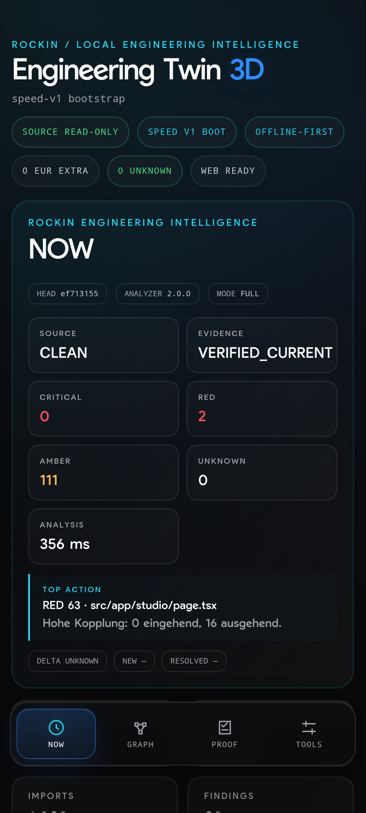
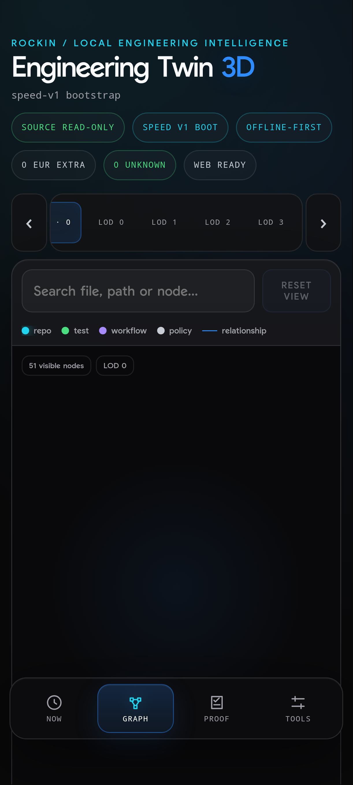
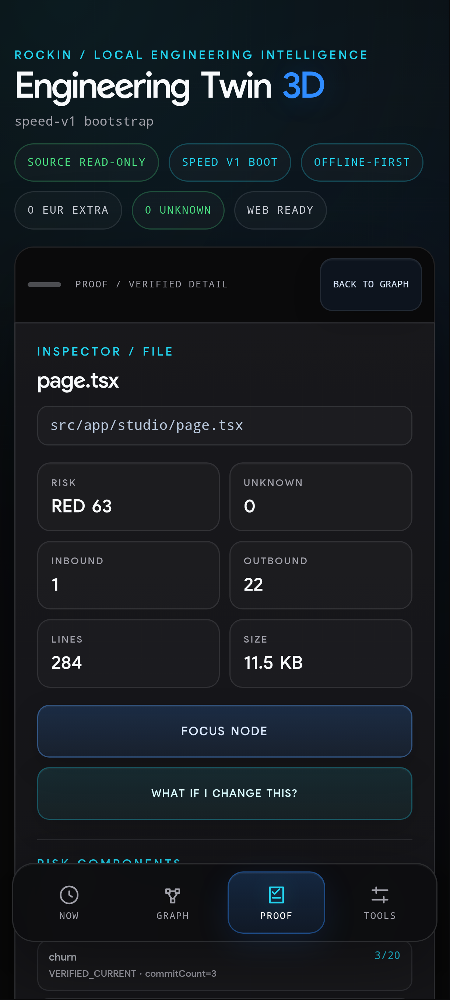

# ENGINEERING TWIN

> **Know what breaks before you change the code.**

Repository Digital Twin for **dependencies, risk, proof and change impact**.

Engineering Twin turns a local Git repository into an evidence-driven engineering model. It connects source structure, imports, tests, workflows, governance, risk and blast radius in one navigable interface.

## Strategic availability

Engineering Twin is available for **strategic acquisition, OEM / white-label discussions and enterprise licensing**.

This repository is the non-confidential public product surface. The private product core, internal release evidence and diligence materials are maintained separately and are disclosed only through an appropriate evaluation process.

- [Buyer overview](BUYER-OVERVIEW.md)
- [Security model](SECURITY.md)
- [Product site](https://rockinai88.github.io/engineering-twin/)
- [Contact RockIn AI](https://github.com/rockinai88)

## What it helps answer

- What depends on this component?
- Which tests protect it?
- Which workflows and policies are connected?
- Where is engineering risk concentrated?
- What may be affected before a change is made?
- What evidence supports each conclusion?

## Product pillars

| Surface | Purpose |
|---|---|
| STRUCTURE | Repository architecture |
| DEPENDENCIES | Import and dependency relationships |
| TESTS | Test mapping and protection |
| WORKFLOWS | CI/CD relationships |
| GOVERNANCE | Policies and protected areas |
| RISK | Prioritized engineering risk |
| PROOF | Evidence behind conclusions |
| IMPACT | Change-impact and blast-radius analysis |

## Security model

- Local-first analysis
- Source repository remains read-only
- Loopback-only local UI
- Offline-first runtime
- Exact Git SHA evidence
- No customer repository data or product secrets are stored in this public repository

## Evaluation path

1. Review the public product evidence and screenshots.
2. Establish an NDA before private technical disclosure.
3. Run a private demo against an authorized repository and record the exact Git SHA.
4. Review architecture, OSS / third-party inventory, acceptance criteria and known limits.
5. Select the commercial structure: acquisition, OEM / white-label or enterprise licensing.

## Commercial structures

Engineering Twin can be discussed under three separate structures after intended use, deployment scope, rights, support and acceptance requirements are defined:

- **A — Enterprise License**: defined use rights; ownership and non-granted rights remain with the provider.
- **B — OEM / White-Label**: separately defined embedding, branding and redistribution rights.
- **C — Asset / Rights Transfer**: only expressly listed transferable assets and expressly defined rights of use.

This public repository is informational only. Commercial terms are transaction-specific and require agreed scope.

## Product preview

## Important

This repository is the **public product, documentation and commercial surface only**.

It does **not** contain the private Engineering Twin analyzer, risk engine, impact engine, proof engine, entitlement backend, signing material or internal release evidence.

## Status

Strategic acquisition, OEM / white-label and enterprise licensing discussions are open under the RockIn AI brand.

**Private engineering. Public product evidence.**
